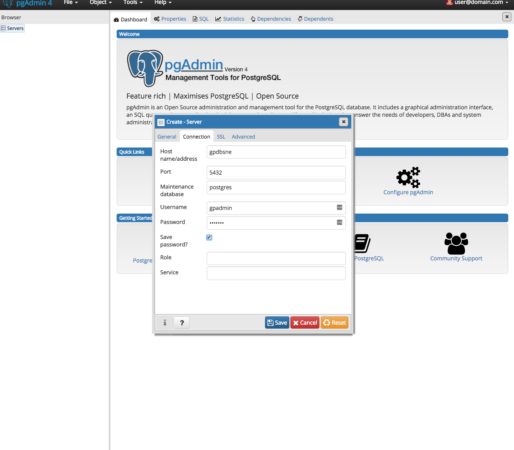
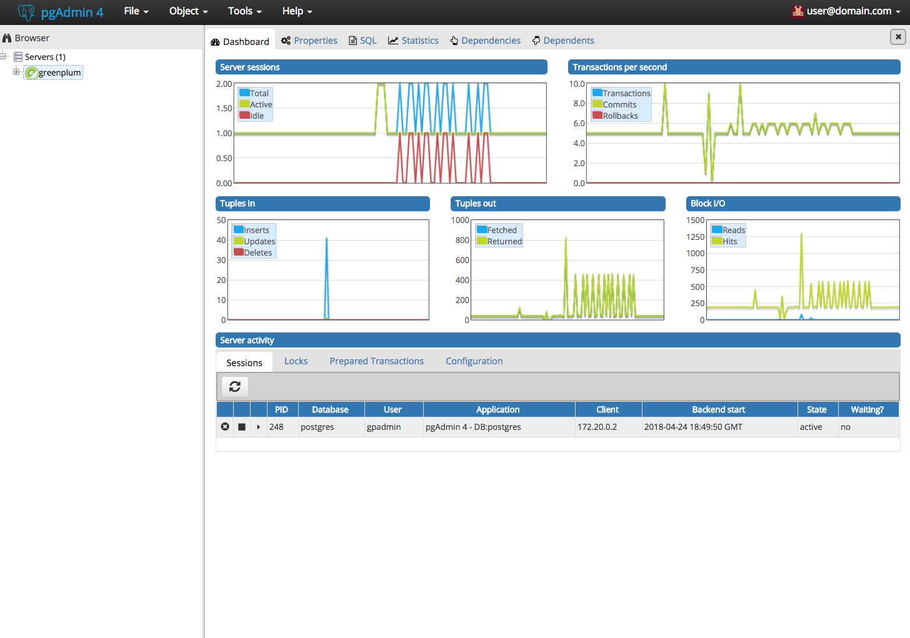

# Pivotal Greenplum
The Pivotal Greenplum Database (GPDB) is an advanced, fully featured, open source data warehouse. It provides powerful and rapid analytics on petabyte scale data volumes. Uniquely geared toward big data analytics, Greenplum Database is powered by the world’s most advanced cost-based query optimizer delivering high analytical query performance on large data volumes.
<https://pivotal.io/pivotal-greenplum>

# pgAdmin
pgAdmin is the most popular and feature rich Open Source administration and development platform for PostgreSQL, the most advanced Open Source database in the world.
<https://www.pgadmin.org/>

# Table of Contents
1. [Pre-requisites](#Pre-requisites)
2. [Starting Docker-compose](#Starting-Docker-compose)
3. [Configure Greenplum](#Configure-Greenplum)
4. [Configure pgadmin4](#Configure-pgadmin4)

## Pre-requisites:
- [docker-compose](http://docs.docker.com/compose)
- [pgadmin4 docker image](https://hub.docker.com/r/dpage/pgadmin4/)
- [GPDB 5.x OSS docker image](https://hub.docker.com/r/kochanpivotal/gpdb5oss/)

## Starting Docker-compose
Once you have cloned this repository, you can run the command  `./runDocker.sh -t usecase1 -c up`, in order to start both Greenplum and pgadmin4 docker instances.

The assumption: docker and docker-compose are already installed on your machine.

### Run command to start both Greenplum and pgadmin4 instances
```
Kongs-MacBook-Pro:greenplum-pgadmin4 kochan$ ./runDocker.sh -t usecase1 -c up
Starting usecase1_sdc_1 ... done
Starting gpdbsne        ... done
Attaching to usecase1_sdc_1, gpdbsne
sdc_1    | [2018-04-24 19:06:59 +0000] [1] [INFO] Starting gunicorn 19.7.1
sdc_1    | [2018-04-24 19:06:59 +0000] [1] [INFO] Listening at: http://0.0.0.0:80 (1)
sdc_1    | [2018-04-24 19:06:59 +0000] [1] [INFO] Using worker: threads
sdc_1    | [2018-04-24 19:06:59 +0000] [8] [INFO] Booting worker with pid: 8
gpdbsne  | /bin/run-parts
gpdbsne  | Running /docker-entrypoint.d
gpdbsne  | Running bin/bash -c startGPDB.sh  && bin/bash
gpdbsne  | SSHD isn't running
gpdbsne  |  * Starting OpenBSD Secure Shell server sshd                  [ OK ]
gpdbsne  | SSHD is running...
...
```
### How to access Greenplum docker instance:
You can use this command `docker exec -it gpdbsne bin/bash` to access Greenplum docker instance.

For example:
```
Kongs-MacBook-Pro:code_spark kochan$ docker ps
CONTAINER ID        IMAGE                           COMMAND                  CREATED                  STATUS              PORTS                                                                                                                                NAMES
a5d6868b53d5        dpage/pgadmin4                  "/entrypoint.sh"         Less than a second ago   Up 4 seconds        0.0.0.0:80->80/tcp, 443/tcp                                                                                                          usecase1_pgadmin4_1
5ff24222b1f7        kochanpivotal/gpdb5oss:latest   "/docker-entrypoint.…"   27 minutes ago           Up 1 second         0.0.0.0:5005->5005/tcp, 0.0.0.0:5010->5010/tcp, 0.0.0.0:5432->5432/tcp, 0.0.0.0:40000-40002->40000-40002/tcp, 0.0.0.0:9022->22/tcp   gpdbsne
Kongs-MacBook-Pro:code_spark kochan$

```

## Configure Greenplum
Once you have access to Greenplum docker instance, you can create database, table with some sample data.

1. Create database and table with sample database
The scripts to create database and sample data is found at `/code/usercase1/data`.

Next, run the command '/code/usecase1/data/setupDB.sh'
```
root@gpdbsne:/# cd /code/usecase1/data
root@gpdbsne:/code/usecase1/data# ./setupDB.sh
psql:./gpdb_sample.sql:2: NOTICE:  table "usertable" does not exist, skipping
DROP TABLE
CREATE TABLE
root@gpdbsne:/code/usecase1/data#
```
2. Verify database and table is created.
Use the command `su - gpadmin`, followed by `psql -U gpadmin -d example_db -c "select count(*) from usertable;"`.  The result shows no records are yet created.

Example:
```
root@gpdbsne:/code/usecase1/data#su - gpadmin
$
$ psql -U gpadmin -d example_db -c "select count(*) from usertable;"
 count
-------
     0
(1 row)
```

## Configure pgadmin4 to load data into Greenplum
1. Access [pgadmin4 console](http://localhost:80/) via browser

2. Use `user@domain.com` as username and `SuperSecret` as password.

3. You can add new server.


4. Once you configured GPDB, you can view the dashboard.


```
